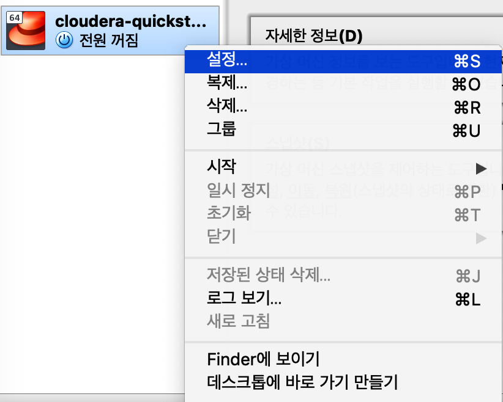
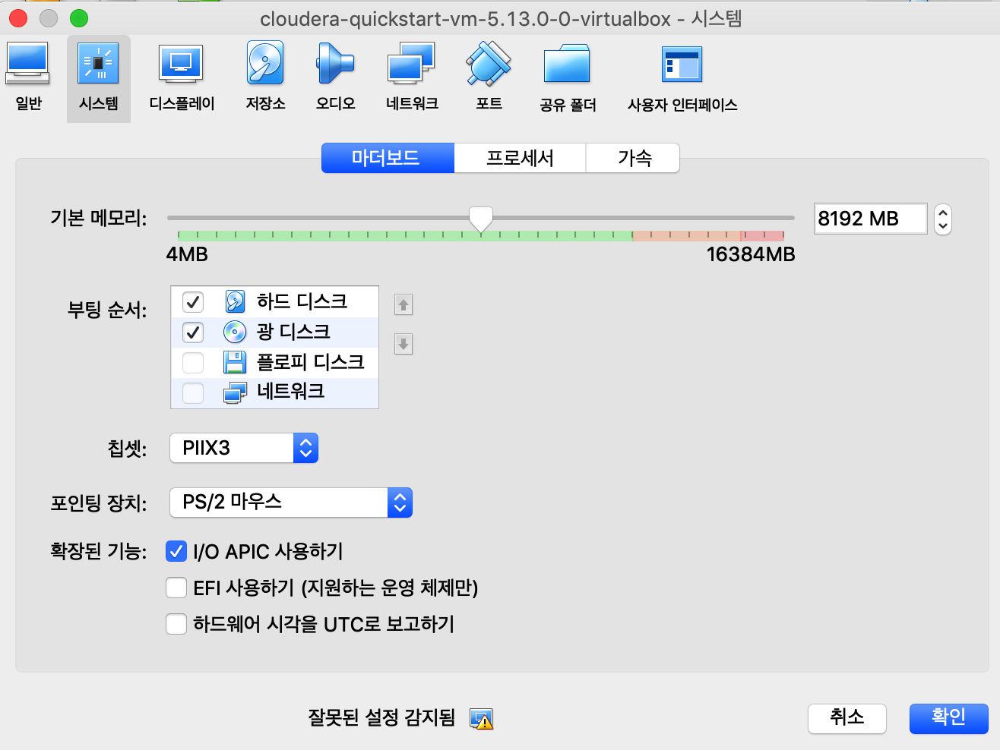
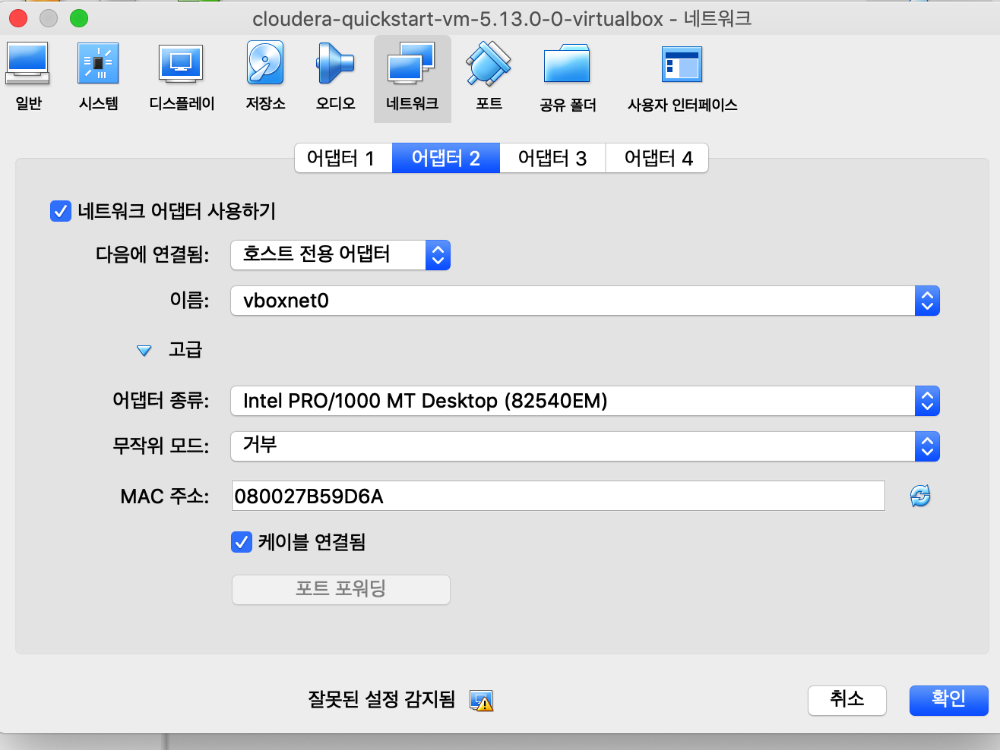

> [Virtual Box 5.2 Version](https://www.virtualbox.org/wiki/Download_Old_Builds_5_2)을 사용해서 실습 진행하였습니다.

## Cloudera VM 다운로드
- cloudera 사이트 계정이 없다면 회원 가입부터 하는 것을 추천  
(Cloudera VM 다운로드를 위해선 로그인을 하거나 개인정보 몇가지를 넣어야 함)
- 아래 URL로 가서 Platform을 Virtual Box로 선택한 후 `GET IT NOW` 버튼을 클릭  
[https://www.cloudera.com/downloads/quickstart_vms/5-13.html](https://www.cloudera.com/downloads/quickstart_vms/5-13.html)
- 용량(5.89GB)이 꽤 큰 파일을 다운로드 한 후 압축해제

## 가상머신 가져오기
- 파일 > 가상 시스템 가져오기 > 압축해제 한 폴더에서 `cloudera-quickstart-vm-5.13.0-0-virtualbox.ovf` 파일 선택  


- Cloudera VM 우클릭 > 설정  


- 일반 > 고급 탭 > 클립보드, 드래그 앤 드롭 양방향으로 설정  


- 시스템 > 마더보드 > 메모리 설정(여유가 되는만큼 설정)  


<hr/>

#### 아래 글은 로컬 PC에서 Cloudera VM에 원격으로 붙어서 실습을 진행하기 위한 설정이므로 꼭 해야할 필요는 없습니다~!
<hr/>

- 네트워크 > 어댑터2에 호스트 전용 어댑터 설정

    > [Virtual Box를 활용한 Spark 실습 환경 구축](https://wooyoung85.tistory.com/35) Post에 3. VirtualBox 네트워크 구성을 참고해서 **호스트 네트워크를 미리 설정한 후** 어댑터 설정을 해야함

## Cloudera VM 네트워크 설정
```bash
$> sudo vi /etc/sysconfig/network-scripts/ifcfg-eth1
    ### 아래 내용 입력
    ### 저는 고정 IP를 192.168.56.120로 설정하였습니다 ^^
    DEVICE=eth1
    TYPE=Ethernet
    IPADDR=192.168.56.120
    NETMASK=255.255.255.0
    ONBOOT=yes
    BOOTPROTO=static
    NM_CONTROLLED=yes

# 그냥 network 재시작하면 에러 발생하기 때문에 NetworkManager 를 꼭 먼저 정지해야 함
$> sudo service NetworkManager stop
$> sudo service network restart
$> sudo service NetworkManager start
```
## 로컬 PC의 host 파일에 아래와 같이 추가
```
192.168.56.120	quickstart.cloudera
```

## ssh 접속
```bash
$> ssh cloudera@192.168.56.120
```