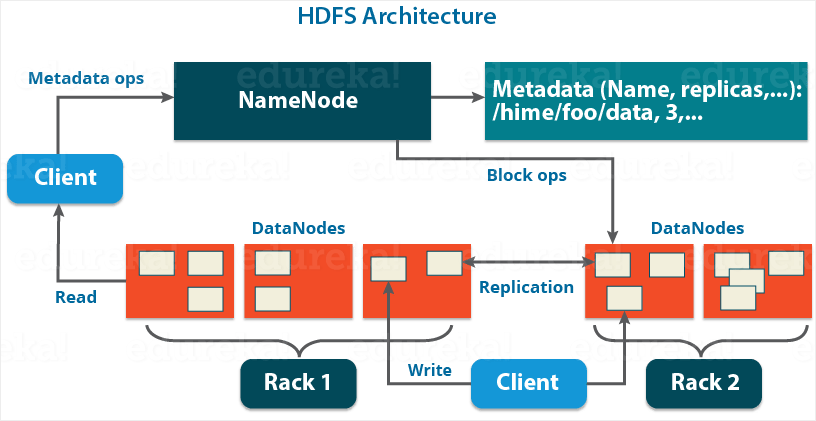
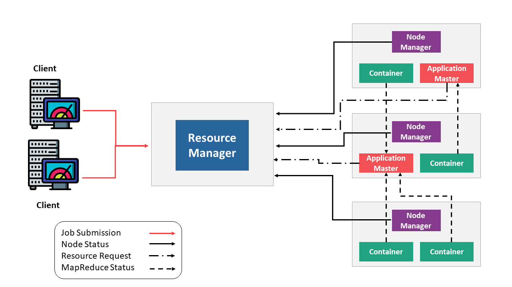

# Hadoop이란?

 The Apache Hadoop software library is a framework that allows for the distributed processing of large data sets across clusters of computers using simple programming models.  

It is designed to scale up from single servers to thousands of machines, each offering local computation and storage.  

Rather than rely on hardware to deliver high-availability, the library itself is designed to detect and handle failures at the application layer, so delivering a highly-available service on top of a cluster of computers, each of which may be prone to failures.

출처 : [Apache Hadoop](https://hadoop.apache.org/)

- simple한 프로그래밍 모델을 사용하여 클러스터 컴퓨팅 환경에서 빅 데이터 분산 처리 가능
- 한 대에서 수천대의 머신으로 scale up할 수 있게 설계되었고, 각 머신들은 local 연산과 저장을 제공함
- 고가용성(High Availability)을 제공하기 위해 하드웨어에 의존하기 보다는 소프트웨어(Application) 계층에서 장애를 감지하고 핸들링 하도록 설계됨

> **Hadoop은 Software이고 Software(Hadoop)가 BigData 처리를 가능하게 했다라는게 중요한 포인트**  

## Hadoop은 어떻게 BigData를 처리할까?
Hadoop은 **분산저장(HDFS)** 과 **병렬처리(Yarn, MapReduce)** 를 통해 BigData를 처리함

# HDFS
- 파일을 작은 block(default : 128MB)으로 쪼개서 클러스터 상의 여러 머신에 분산 저장
- fault-tolerance를 위해 파일 block들의 복제본(default : 3)을 생성하여 저장
- HDFS Block Size와 Replicator Factor는 변경할 수 있음

## HDFS Architecture (Master/Worker)

이미지 출처 : https://www.edureka.co/blog/apache-hadoop-hdfs-architecture/

Master 역할을 하는 네임노드 서버 한 대와, Worker 역할을 하는 데이터노드 서버가 여러 대로 구성

#### Name Node (NN)
- 메타 데이터 저장 및 관리  
  (Block들이 저장되는 디렉토리명, 파일명과 어떤 머신에 어떤 Block이 저장되어 있는지 등을 관리)
- 메타 데이터는 `fsimage` (NN의 메모리 상태를 가지고 있는 파일, Current SnapShot)와 `edits` (변경 사항을 가지고 있는 log 파일)로 구성되어 있음 

#### Data Node (DN)
- 실제 데이터(Block)를 저장 

#### Secondary Name Node (2NN)
- NN의 백업 용도 (**대체 X**)  
- `fsimage` 와 `edits` 를 일정시간 마다 **merge** 하고 이를 다시 NN에게 전달
- Hadoop 2.0 부터 NameNode 2대로 H.A(High Availability) 구성을 제공함
- Name Node 2대로 H.A 구성을 하면 Stanby Name Node가 Secondary Name Node를 대체함
- 자세한 내용은 아래 글 참고  
  [Hadoop 에서 Secondary Namenode 의 역활](https://charsyam.wordpress.com/2011/04/06/hadoop-%EC%97%90%EC%84%9C-secondary-namenode-%EC%9D%98-%EC%97%AD%ED%99%9C/)  
  [Hadoop의 Secondary Namenode는 백업용이 아닙니다](http://www.databaser.net/moniwiki/wiki.php/Hadoop%EC%9D%98SecondaryNamenode%EB%8A%94%EB%B0%B1%EC%97%85%EC%9A%A9%EC%9D%B4%EC%95%84%EB%8B%99%EB%8B%88%EB%8B%A4)

# YARN Framework

The fundamental idea of YARN is to split up the functionalities of resource management and job scheduling/monitoring into separate daemons. The idea is to have a global ResourceManager (RM) and per-application ApplicationMaster (AM). An application is either a single job or a DAG of jobs.

The ResourceManager and the NodeManager form the data-computation framework. The ResourceManager is the ultimate authority that arbitrates resources among all the applications in the system. The NodeManager is the per-machine framework agent who is responsible for containers, monitoring their resource usage (cpu, memory, disk, network) and reporting the same to the ResourceManager/Scheduler.

The per-application ApplicationMaster is, in effect, a framework specific library and is tasked with negotiating resources from the ResourceManager and working with the NodeManager(s) to execute and monitor the tasks.

출처 : [Apache Hadoop YARN](https://hadoop.apache.org/docs/current/hadoop-yarn/hadoop-yarn-site/YARN.html) 

- Hadoop 1.0 시절 MapReduce(ver.1.0)의 `JobTracker`가 혼자 수행했던 역할(resource management와 job scheduling/monitoring)을 분리하려고 만들었음
- resource management 👉 **`ResourceManager`**
- job scheduling/monitoring 👉 **`ApplicationMaster`**
- ResouceManager와 NodeManager는 데이터 처리 프레임워크를 형성함
- ResouceManager는 시스템 내의 모든 Application 간 자원들을 중재하는 강력한 권한을 가짐
- NodeManager는 각 서버의 Container(CPU, Disk, Memory 등) 를 담당하는 Agent이고, 관련 정보를 ResourceManager/Scheduler에게 보고함

## Yarn Architecture

이미지 출처 : https://www.edureka.co/blog/hadoop-yarn-tutorial/

#### ResourceManager
- 클러스터에 1개 존재
- `Scheduler`와 `Application Manager`로 구성되어 있음
  - `Scheduler`  
    - Application에 자원(=container)을 할당함 
    - 순수하게 스케쥴러 기능만 있음 (상태 모니터링, fault-tolerant 등의 기능들은 전혀 X)
  - `Application Manager`
    - Client로부터 Application(Job) 실행요청이 오면 ApplicationMaster 실행을 담당
    - 실패시 ApplicationMaster 컨테이너를 다시 시작하는 서비스를 제공

#### Node Manager
- DataNode가 있는 머신에 쌍으로 1개씩 존재
- Container를 모니터링하고, 관련 정보를 ResourceManager/Scheduler에게 보고함

#### Application Master
- Application 당 1개 생성됨
- Scheduler로부터 적절한 자원 컨테이너를 협상
- Application 상태를 추적하고 진행 상황을 모니터링함
 
#### Container
- Package of resources including RAM, CPU, Network, HDD etc on a single node.

# MapReduce

Hadoop MapReduce is a software framework for easily writing applications which process vast amounts of data (multi-terabyte data-sets) in-parallel on large clusters (thousands of nodes) of commodity hardware in a reliable, fault-tolerant manner.

출처 : [MapReduce Tutorial](https://hadoop.apache.org/docs/stable/hadoop-mapreduce-client/hadoop-mapreduce-client-core/MapReduceTutorial.html) 

- 큰 클러스터 상에 많은 양의 데이터를 병렬로 처리하는 Application을 쉽게 만들 수 있는 소프트웨어 프레임워크

> Hadoop 뿐만 아니라 Hive, Sqoop, Flume 등과 같은 Hadoop Eco System에서도 MapReduce를 활용하여 실제 작업을 수행하기 때문에 MapReduce에 대한 이해가 중요함

## MapReduce Phase
#### 1. Mapper Phase
- Input 데이터를 처리하는 작업
- 일반적으로 Input 데이터는 HDFS에 Block 단위로 저장되어 있기 때문에 Data Node에서 Mapper Task 실행
- 수행 결과는 Local Disk 에 임시파일로 저장
- `Map(k1,v1) → list(k2,v2)`

#### 2. Shuffle and Sort Phase
- Mapper의 수행결과를 병합(merge)과 정렬(sort)하여 Reducer로 전달

#### 3. Reducer Phase
-  Mapper의 수행결과에 Shuffle & Sort 작업을 수행한 중간 결과물에서 원하는 데이터를 추출하여 HDFS에 저장
-  `Reduce(k2, list (v2)) → list(v3)`

## MapReduce 작업 종류
- 리듀서가 하나인 경우
- 리듀서가 여러개인 경우
- 리듀서가 없는 경우 (Mapper Only)

# Hadoop Commands
[http://hadoop.apache.org/docs/current/hadoop-project-dist/hadoop-common/FileSystemShell.html](http://hadoop.apache.org/docs/current/hadoop-project-dist/hadoop-common/FileSystemShell.html)

## 참고자료
[1-처리 단계 - 빅데이터 - 하둡, 하이브로 시작하기](https://wikidocs.net/22937)  
[Hadoop Mapper – 4 Steps Learning to MapReduce Mapper](https://data-flair.training/blogs/hadoop-mapper-in-mapreduce/)  
[3-맵리듀스 - 빅데이터 - 하둡, 하이브로 시작하기](https://wikidocs.net/22827)  
[Hadoop YARN Tutorial – Learn the Fundamentals of YARN Architecture](https://www.edureka.co/blog/hadoop-yarn-tutorial/)